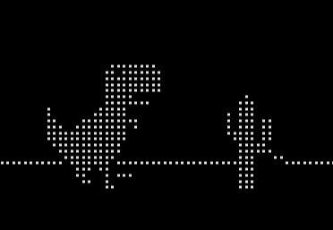

# Console T-Rex Game



This is a console-based game inspired by the Google Chrome T-Rex dinosaur game, developed in C. The game provides a minimalistic experience with keyboard controls and a dynamic console interface.

## Table of Contents

- [Features](#features)
- [Requirements](#requirements)
- [Installation](#installation)
- [Usage](#usage)
- [Gameplay](#gameplay)
- [Configuration](#configuration)
- [Contributing](#contributing)
- [License](#license)

---

## Features

- **Console-based** gameplay with simple ASCII graphics.
- **Dynamic terminal resizing** support.
- **Player movement and obstacles**, including an enemy and clouds.
- **Score tracking**.
- **Day/Night cycle** with sun, moon, and clouds.

## Requirements

- **Operating System**: Unix-based systems (Linux, macOS).
- **Dependencies**: 
  - Standard C libraries (`stdlib.h`, `stdio.h`, etc.).
  - Terminal control libraries (`ioctl`, `unistd.h`).

Make sure you have a C compiler installed, like `gcc` or `clang`.

## Installation

1. Clone the repository:
    ```bash
    git clone https://github.com/StiveMan1/T-RexC.git
    cd T-RexC
    ```

2. Compile the game:
    ```bash
    gcc trex-c.c -O3 -lm -o trex-c
    ```

3. Run the game:
    ```bash
    ./trex-c
    ```

## Usage

The game runs directly in the terminal. Use the following keys to control your character:

- **Space bar**: Jump and Start game
- **Arrow Up**: Jump and Start game
- **Arrow Down**: Crouch and Start game
- **R**: Restart in Spectator Mod

## Gameplay

Avoid obstacles (represented by enemies on the screen) to keep your character alive. The score increases as you survive longer, with a higher score indicating better performance. Watch out for the changing day and night cycle, and use the jump function to avoid enemies and ground obstacles.

## Configuration

Some gameplay and display elements can be configured:

- **Game height and width**: Automatically adapts to the console window size.
- **Score**: Displays in the top corner.
- **Environment**: Dynamic day/night cycle, clouds, sun, and moon.

## Code Structure

- **`dino.c`**: Contains the `main` function and game loop.
- **`update_console_events()`**: Manages all screen updates, from player movement to obstacle generation and score display.
- **`keyboard_handler()`**: Handles player inputs.
- **`draw_*()` functions**: Render various elements like the player, obstacles, ground, and sky.

## Contributing

1. Fork the repository.
2. Create a new branch (`git checkout -b feature-branch`).
3. Commit your changes (`git commit -m 'Add new feature'`).
4. Push to the branch (`git push origin feature-branch`).
5. Open a Pull Request.

All contributions are welcome! Please follow the coding style found in the existing code and add comments where necessary.

## License
This project is licensed under the GNU License. See the [LICENSE](LICENSE) file for details.
